# **KS0077 KS0078 KS0079 Super Learning Kit for Arduino**


# 1.Introduction

keyestudio super learning kit is suitable for Arduino enthusiasts. This kit includes 32 projects with detailed tutorials, starting from the basics to more complex projects.

Different from other kits, it adds some functional modules, such as RFID,temperature and humidity modules. There is connection diagram and code for each project, making it easy for you to learn.

**[Download code, driver and library](https://fs.keyestudio.com/KS0077-78-79)**

# 2.Component List

**NOTE:**
**KS0077 Kit doesn’t include Main board.**  **KS0078 Kit includes V4.0 board.** **KS0079 KIT includes MEGA 2560 board.**

| **No.** | **Product Name**                       | **QT** | **Picture**                                                                                                                                   |
| :--: | :--: | :--: | :--: |
|    1     | LED - Blue                             | 5      |                                                                                                |
|    2     | LED - Red                              | 5      |                                                                                                |
|     3    | LED - Yellow                           | 5      |                                                                                                |
|     4    | LED - RGB                              | 1      |                                                                                                |
|     5    | 220Ω Resistor                          | 8      | 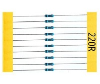                                                                                              |
|     6    | 10KΩ Resistor                          | 5      | 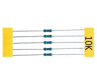                                                                                              |
|     7    | 1KΩ resistor                           | 5      |                                                                                               |
|     8    | 10KΩ Potentiometer                     | 1      |                                                                                                |
|     9    | Buzzer (Active)                        | 1      | 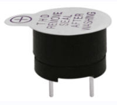                                                                                               |
|    10     | Buzzer (Passive)                       | 1      | 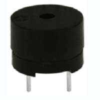                                                                                               |
|     11    | Large Button Switch                    | 4      | 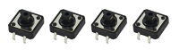                                                                                               |
|     12    | Ball Tilt Sensor                       | 2      |                                                                                                |
|      13   | Photo Resistor                         | 3      |  |
|     14    | Flame Sensor                           | 1      | 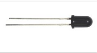                                                                                               |
|    15     | LM35 Temp Sensor                       | 1      | 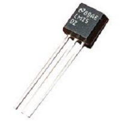                                                                                               |
|    16     | IC 74HC595N 16-pin DIP                 | 1      | 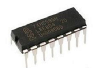                                                                                               |
|    17     | 7-seg LED Segment Display              | 1      |                                                                                                |
|    18     | 7-seg LED Segment Display              | 1      |                                                                                                |
|    19     | 8\*8 LED Matrix                        | 1      | 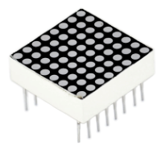                                                                                               |
|    20     | 2x16 LCD display                       |   1    |                                                                                               |
|    21     | IR Receiver                            | 1      | 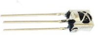                                                                                               |
|     22    | IR Remote Control                      | 1      | 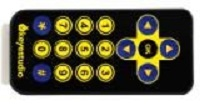                                                                                              |
|    23     | Servo Motor                            | 1      |                                                                                                |
|    24     | Stepper Driver                         | 1      |                                                                                                |
|    25     | Stepper Motor                          | 1      |                                                                                               |
|    26     | Joystick Module                        | 1      |                                                                                               |
|    27     | Relay Module                           | 1      | 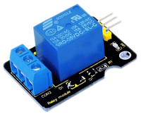                                                                                               |
|    28     | PIR Motion Sensor                      | 1      |                                                                                                |
|    29     | Analog Gas Sensor                      | 1      | 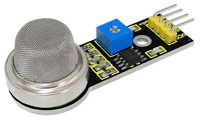                                                                                               |
|    30     | ADXL345 Three Axis Acceleration Module | 1      |                                                                                                |
|    31     | HC-SR04 Ultrasonic Sensor              | 1      |                                                                                                |
|    32     | DS3231 Clock Module                    | 1      |
|    33     | DHT11 Temperature and Humidity Sensor  | 1      | 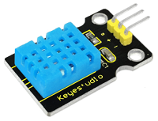                                                                                               |
|    34     | Soil Humidity Sensor                   | 1      | 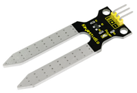                                                                                               |
|    35     | RC522 RFID Module                      | 1      |                                                                                               |
|   36      | RFID Card                              | 1      |                                                                                                |
|     37    | Access Key                             | 1      |                                                                                                |
|   38      | Pin Headers                            | 40     |                                                                                                |
|    39     | 830-hole Breadboard                    | 1      |                                                                                                |
|   40      | Dupont Wire                            | 10     | 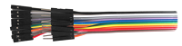                                                                                               |
|    41     | Jumper Wire                            | 30     | 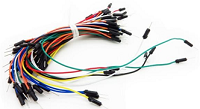                                                                                               |
|     42    | 6-Slot AA  Battery Holder              | 1      |                                                                                                |
|     43    | USB Cable                              | 1      |                                                                                                |

# 3.Install Arduino IDE and Driver

**(1) Installing Arduino IDE**

When we get control board, we need to download Arduino IDE and driver firstly.You could download Arduino IDE from the official website

[https//www.arduino.cc/](https://www.arduino.cc/), click the **SOFTWARE** on the browse bar, click “DOWNLOADS” to enter download page, as shown below


There are various versions Of IDE for Arduino, just download a version that compatible with your system, here we will show you how to download and install the windows version Arduino IDE.


There are two versions of IDE for WINDOWS system, you can choose between the Installer (.exe) and the Zip packages. We suggest you use the first one that installs directly everything you need to use the Arduino Software (IDE), including the drivers. With the Zip package you need to install the drivers
manually. The Zip file is also useful if you want to create a portable installation.


You just need to click JUST DOWNLOAD.

(2) **keyestudio V4.0 Development Board**

We need to know keyestudio V4.0 development board, as a core of this smart car.

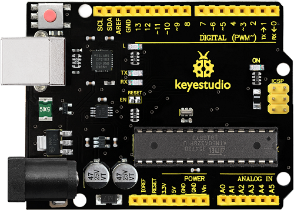

keyestudio V4.0 development board is an Arduino board, which is based on ATmega328P MCU, and with a cp2102 Chip as a UART-to-USB converter.


It has 14 digital input/output pins (of which 6 can be used as PWM outputs), 6 analog inputs, a 16 MHz quartz crystal, a USB connection, a power jack, 2 ICSP headers and a reset button.


It contains everything needed to support the microcontroller; simply connect it to a computer with a USB cable or power it via an external DC power jack (DC 7-12V) or via female headers Vin/ GND(DC 7-12V) to get started.

| Microcontroller             | ATmega328P-PU                                            |
|-----------------------------|----------------------------------------------------------|
| Operating Voltage           | 5V                                                       |
| Input Voltage (recommended) | DC7-12V                                                  |
| Digital I/O Pins            | 14 (D0-D13)  (of which 6 provide PWM output)             |
| PWM Digital I/O Pins        | 6 (D3, D5, D6, D9, D10, D11)                             |
| Analog Input Pins           | 6 (A0-A5)                                                |
| DC Current per I/O Pin      | 20 mA                                                    |
| DC Current for 3.3V Pin     | 50 mA                                                    |
| Flash Memory                | 32 KB (ATmega328P-PU) of which 0.5 KB used by bootloader |
| SRAM                        | 2 KB (ATmega328P-PU)                                     |
| EEPROM                      | 1 KB (ATmega328P-PU)                                     |
| Clock Speed                 | 16 MHz                                                   |
| LED_BUILTIN                 | D13                                                      |

(3) **Keyestudio MEGA 2560 Board**

Keyestudio Mega 2560 R3 is a microcontroller board based on the ATMEGA2560-16AU, fully compatible with ARDUINO MEGA 2560 R3.

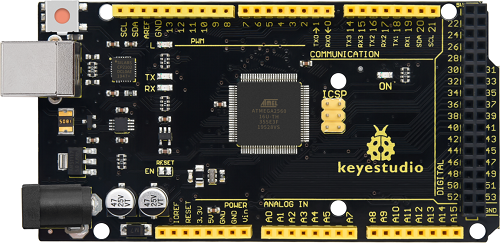

It has 54 digital input/output pins (of which 15 can be used as PWM outputs), 16 analog inputs, 4 UARTs (hardware serial ports), a 16 MHz crystal oscillator, a USB connection, a power jack, 1 ICSP header, and a reset button. The built-in ICSP port can burn the firmware for ATMEGA2560-16AU directly. This chip is burnt the firmware well before leaving the factory, therefore, we hardly use it. We can power on by USB wire, DC head and Vin GND pins. To facilitate wiring, a 0.5m USB wire is provided for you.


Specialized Functions of Some Pins:

1\. Serial Communication: D0 (RX0) and D1 (TX1); Serial 1: D19 (RX1) and D18(TX1); Serial 2: D17 (RX2) and D16 (TX2); Serial 3: D15 (RX3) and D14 (TX3). Used to receive (RX) and transmit (TX) TTL serial data. Pins 0 and 1 are also connected to the corresponding pins of the CP2102 USB-to-TTL Serial chip.

2\. PWM Pins (Pulse-Width Modulation): D2 to D13, and D44 to D46. Provide 8-bit PWM output with the analogWrite() function.

3\. External Interrupts: D2 (interrupt 0), D3 (interrupt 1), D18 (interrupt 5), D19 (interrupt 4), D20 (interrupt 3), and D21 (interrupt 2). These pins can be configured to trigger an interrupt on a low level, a rising or falling edge, or a change in level. See the attachInterrupt() function for details.

4\. SPI communication: D53 (SS), D52 (SCK), D51 (MOSI), D50 (MISO). These pins support SPI communication using theSPI library. The SPI pins are also broken out on the ICSP header, which is physically compatible with the Arduino Uno.

5\. IIC communication: D20 (SDA); D21 (SCL). Support TWI communication using the Wire library.

(4) **Installing V4.0 board Driver**

Let’s install the driver of keyestudio V4.0 board. The USB-TTL chip on V4.0 board adopts CP2102 serial chip. The driver program of this chip is included in Arduino 1.8 version and above, which is convenient. Plug on USB port of board, the computer can recognize the hardware and automatically install the driver of CP2102.

If install unsuccessfully, or you intend to install manually, open the device manager of computer. Right click Computer----- Properties----- Device Manager


There is a yellow exclamation mark on the page, which implies installing unsuccessfully. Then we double click the hardware and update the driver.

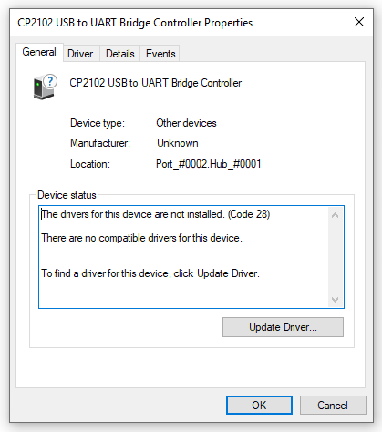

Click “OK” to enter the following page, click “browse my computer for updated driver software”, find out the installed or downloaded ARDUINO software. As shown below

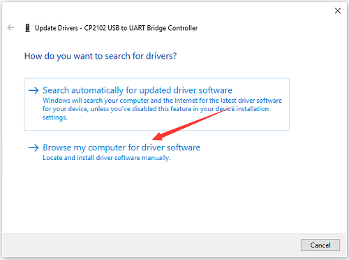

There is a DRIVERS folder in Arduino software installed package（）, open driver folder and you can see the driver of CP210X series chips.

We click “Browse”, then find out the driver folder, or you could enter “driver” to search in rectangular box, then click “next”, the driver will be installed successfully. (I place Arduino software folder on the desktop, you could follow my way)


Open device manager, we will find the yellow exclamation mark disappear. The driver of CP2102 is installed successfully.


**The installation method of keyestudio MEGA 2560 board and V4.0 board is same**

(5) **Arduino IDE Setting**

Clickicon，open Arduino IDE.


To avoid the errors when uploading the program to the board, you need to select the correct Arduino board that matches the board connected to your computer.

Then come back to the Arduino software, you should click Tools→Board, select the board. (as shown below)

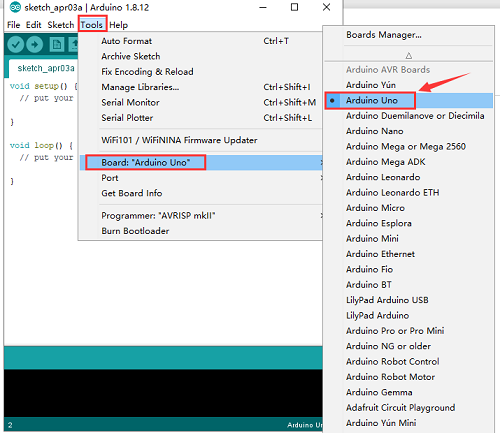

Then select the correct COM port (you can see the corresponding COM port after the driver is successfully installed)


Before uploading the program to the board, let’s demonstrate the function of each symbol in the Arduino IDE toolbar.


A- Used to verify whether there is any compiling mistakes or not.  
B- Used to upload the sketch to your Arduino board.  
C- Used to create shortcut window of a new sketch.  
D- Used to directly open an example sketch.  
E- Used to save the sketch.  
F- Used to send the serial data received from board to the serial monitor.

(6) **Start First Program**

Open the file to select Example, choose BLINK from BASIC, as shown below


Set board and COM port, the corresponding board and COM port are shown on the lower right of IDE.

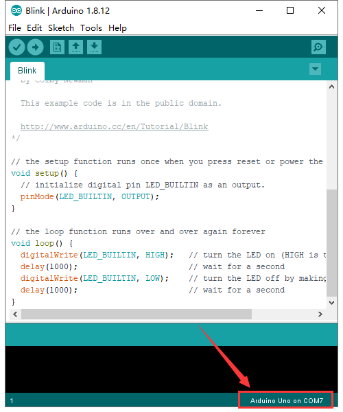

Clickto start compiling the program, check errors.


Clickto upload the program, upload successfully.

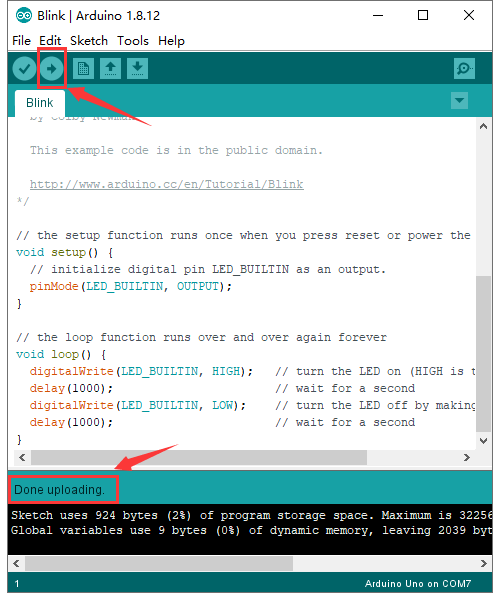

Upload the program successfully, the onboard LED lights on for 1s, lights off for 1s. Congratulation, you finish the first program.

**If it is keyestudio MEGA 2560 board, please select Arduino MEGA or MEGA 2560 board**

# 4.How to Add a Library?

What are Libraries ?

[Libraries](https://www.arduino.cc/en/Reference/Libraries) are a collection of code that makes it easy for you to connect to a sensor,display, module, etc.

For example, the built-in LiquidCrystal library helps talk to LCD displays. There are hundreds of additional libraries available on the Internet for download.

The built-in libraries and some of these additional libraries are listed in the reference.

How to Install a Library ?

Here we will introduce the most simple way for you to add libraries .  Step 1After downloading well the Arduino IDE, you can right-click the icon of Arduino IDE.  
Find the option "Open file location" shown as below

[](http://wiki.keyestudio.com/index.php/File:Libraries_1.png)

Step 2 Enter it to find out libraries folder, this folder is the library file of Arduino.


Step 3 Next to find out the “libraries” folder of this kit(seen in the link https://fs.keyestudio.com/KS0077-78-79)


You just need to replicate and paste above libraries into the libraries folder of Arduino IDE.

Then the libraries of this kit are installed successfully, as shown below:  
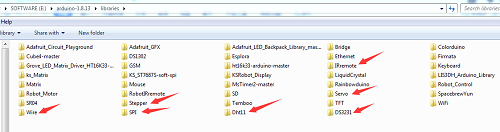

**Note the Arduino software download and the driver installation of keyetudio Mega 2560 R3 board is similar to arduino V4.0 board.**

# 5.Project Details

## Project 1: Hello World


**1.Introduction**

As for starters, we will begin with something simple. In this project, you only need an Arduino and a USB Cable to start the "Hello World!" experiment. It is not only a communication test of your Arduino and PC, but also a primer project for you to have your first try in the Arduino world!

**2.Hardware Required**

-   V4.0 Board or MEGA 2650 Board\*1

-   USB cable\*1

**3.Sample Code**

After installing driver for Arduino, let's open Arduino software and compile code that enables Arduino to print "Hello World!" under your instruction. Of course, you can compile code for Arduino to continuously echo "Hello World!" without instruction.

A simple **If () statement** will do the instruction trick. when Arduino gets an instruction and then to print "Hello World!”.

```c
/*
keyestudio super learning kit
Project 1
Hello World
http//www.keyestudio.com
*/
int val;//define variable val
void setup()
{
Serial.begin(9600);// set the baud rate at 9600 .   
}
void loop()
{
  val=Serial.read();// read the instruction or character from PC to Arduino, and assign them to Val.
  if(val=='R')// determine if the instruction or character received is “R”.
  {  // if it’s “R”,    
     Serial.println("Hello World!");// display“Hello World！”string.
  }
}

```


<iframe src=https://create.arduino.cc/editor/keyestudio/8639a9ec-bab8-498b-8a00-93e6fa4b24a5/preview?embed style="height:510px;width:100%;margin:10px 0" frameborder=0></iframe>


**4.Test Result**

Click to open the serial monitor, input an “R”, PC will receive the information from Arduino Hello World!

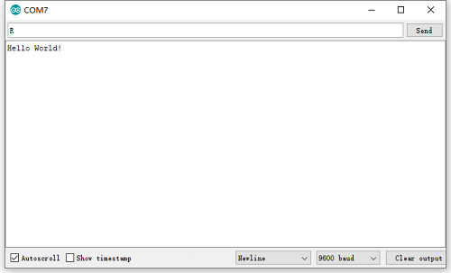

After choosing the proper port, the experiment is easy for you!

## Project 2: LED Blinking


**1.Introduction**

Blinking LED experiment is quite simple. In the "Hello World!" program, we have come across LED. This time, we are going to connect an LED to one of the digital pins rather than using LED13 soldered to the board. Apart from an Arduino and a USB cable, you will need extra parts as below:

**2. Hardware Required**

-   V4.0 Board or MEGA 2650 Board\*1

-   Red M5 LED\*1

-   220Ω Resistor\*1

-   Breadboard\*1

-   Breadboard Jumper Wire\*2

-   USB cable\*1

**3. Little Knowledge**

LED is a type of semiconductor called "Light Emitting Diode "which is an electronic device made of semiconductor materials (silicon, selenium, germanium, etc.). It is dubbed indicator, digital and word display in circuit and device.
It has positive and negative poles. The short leg is negative pole, the long one is positive pole.

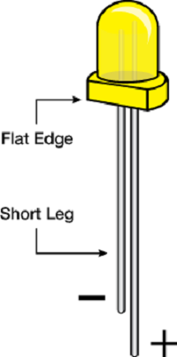

**Resistor：**Resistor is the electronic component in the circuit, which limits
and regulates current flow. Its unit is (Ω).

The units larger than ohms are kiloohms (KΩ) and megaohms (MΩ). When in use, in addition to the size of the resistance, you must also pay attention to its power. In the project, the leads at both ends of the resistor should be bent at a 90° angle to fit the breadboard properly. If the lead is too long, it can be cut to an appropriate length.


A breadboard is used to build and test circuits quickly before finalizing any circuit design. The breadboard has many holes into which circuit components like ICs and resistors can be inserted. A typical breadboard is shown below:

[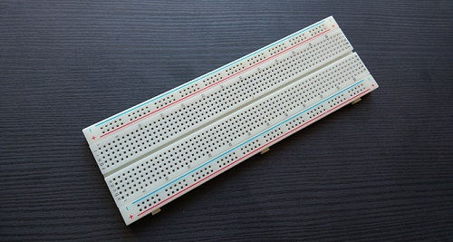](http://file.elecfans.com/web1/M00/AF/08/pIYBAF3dPjeAYci_AAOlUH6caHg207.jpg)

[](http://file.elecfans.com/web1/M00/AE/B1/o4YBAF3dPe-AMZHCAANLJQL0Mg4176.jpg)

The bread board has strips of metal which run underneath the board and connect the holes on the top of the board. The metal strips are laid out as shown below.
Note that the top and bottom rows of holes are connected horizontally while the remaining holes are connected vertically.

[](http://file.elecfans.com/web1/M00/AF/08/pIYBAF3dPl-ACrfJAANAu6lAMIE920.jpg)

To use the bread board, the legs of components are placed in the holes. Each set of holes connected by a metal a strip underneath forms anode.

**4.Circuit Connection**

We follow below diagram from the experimental schematic link. Here we use digital pin 10. We connect LED to a 220 ohm resistor to avoid high current damaging the LED.


**Connection for V4.0**


**Connection for 2560**

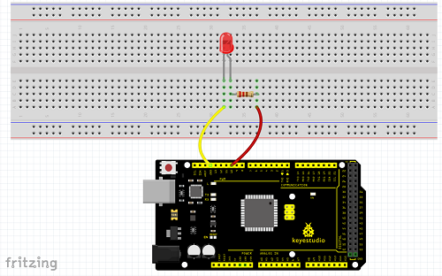

**5.Sample Code**

<iframe src=https://create.arduino.cc/editor/keyestudio/ed7bed09-fa9d-4d82-bbb3-902d9a58dc44/preview?embed style="height:510px;width:100%;margin:10px 0" frameborder=0></iframe>

**6.Test Result**

After uploading this program, in the experiment, you will see the LED connected to pin 10 turning on and off, with an interval of approximate one second.

In this way, blinking LED experiment is now completed. Thank you!


## Project 3: PWM


**1.Introduction**

PWM, short for Pulse Width Modulation, is a technique used to encode analog signal level into digital ones. A computer cannot output analog voltage but only digital voltage values such as 0V or 5V. So we use a high resolution counter to encode a specific analog signal level by modulating the duty cycle of PMW.

**2.Working Principle**

The PWM signal is also digitalized because in any given moment, fully on DC power supply is either 5V (ON), or 0V (OFF). The voltage or current is fed to the analog load (the device that uses the power) by repeated pulse sequence being ON or OFF. Being on, the current is fed to the load; being off, it's not.
With adequate bandwidth, any analog value can be encoded using PWM. The output voltage value is calculated via the on and off time.

Output voltage = (turn on time/pulse time) \* maximum voltage value


PWM has many applications lamp brightness regulating, motor speed regulating, sound making, etc.  
The following are the three basic parameters of PMW.


1.  The amplitude of pulse width (minimum / maximum)

2\. The pulse period (The reciprocal of pulse frequency in one second)

3\. The voltage level（such as 0V-5V）

There are 6 PMW interfaces on Arduino, namely digital pin 3, 5, 6, 9, 10, and 11.

In previous experiments, we have done "button-controlled LED", using digital signal to control digital pin, also one about potentiometer.

This time, we will use a potentiometer to control the brightness of the LED.

**3.Hardware Required**

-   V4.0 Board or MEGA 2650 Board\*1

-   Red M5 LED\*1

-   220Ω Resistor

-   Breadboard\*1

-   Breadboard Jumper Wire\*6

-   USB cable\*1

**4.Circuit Connection**


**Connection for V4.0**


**Connection for 2560 R3**


**5.Sample Code**

<iframe src=https://create.arduino.cc/editor/keyestudio/86e10b4d-97f8-4a88-82df-3841bd57e276/preview?embed style="height:510px;width:100%;margin:10px 0" frameborder=0></iframe>


**6.Test Result**

Hook up via connection diagram, upload the code and plug in power. The external LED lights up then gets dark gradually, which looks like human breath.


## Project 4: Traffic Light


**1.Introduction**

In the previous program, we have done the LED blinking experiment with one LED. Now, it’s time to up the stakes to do a bit more complicated experiment-traffic light. Actually, these two experiments are similar. While in this traffic light experiment, we use three LEDs with different colors rather than an LED.

**2.Hardware Required**

-   V4.0 Board or MEGA 2650 Board\*1

-   USB Cable \*1

-   Red M5 LED\*1

-   Yellow M5 LED\*1

-   Blue M5 LED\*1

-   220Ω Resistor \*3

-   Breadboard\*1

-   Breadboard Jumper Wire \*4

**3.Circuit Connection**

****

**Connection for V4.0**


**Connection for 2560**


**4. Sample Code**

Since it is a simulation of traffic lights, the blinking time of each LED should be the same with those in traffic lights system.

In this program, we use Arduino **delay ()** function to control delay time, which is much simpler than C language.

<iframe src=https://create.arduino.cc/editor/keyestudio/39a465e8-809c-4741-82ae-a0a5137111b9/preview?embed style="height:510px;width:100%;margin:10px 0" frameborder=0></iframe>

**5.Test Result**

When the uploading process is completed, you can see traffic lights of your own design. Note this circuit design is very similar with the one in LED chasing effect.

The blue light will be on for 5 seconds, and then off, followed by the yellow light blinking for 3 times, and then the red light is on for 5 seconds, repeatedly forming a cycle.

Experiment is now completed, thank you!


## Project 5: LED Chasing Effect


**1.Introduction**

We can see many billboards composed of colorful LEDs. They are constantly changing to form various effects. In this experiment, we compile a program to simulate chase effect.

**2.Hardware Required**

-   V4.0 Board or MEGA 2650 Board\*1

-   Red LED\*6

-   220Ω Resistor \*6

-   Breadboard Jumper Wire\*12

-   USB cable\*1

**3.Circuit Connection**

****

**Connection for V4.0**


**Connection for 2560**


**4.Sample Code**

<iframe src=https://create.arduino.cc/editor/keyestudio/47b58c34-9632-450e-a430-751b8579bbf4/preview?embed style="height:510px;width:100%;margin:10px 0" frameborder=0></iframe>


**5.Test Result**

You can see the LEDs blink by sequence.


## Project 6: Button-Controlled LED


**1.Introduction**

I/O port means interface for INPUT and OUTPUT. Up to now, we have only used the OUTPUT function.

In this experiment, we will try to use the INPUT function, which is to read the output value of device connecting to it.

We use 1 button and 1 LED using both input and output to give you a better understanding of the I/O function.

Button switch, familiar to most of us, is a switch value (digital value) component. When it's pressed, the circuit is in closed (conducting) state.

**2.Hardware Required**

-   V4.0 Board or MEGA 2650 Board\*1

-   Button switch\*1

-   Red M5 LED\*1

-   220ΩResistor\*1

-   10KΩ Resistor\*1

-   Breadboard\*1

-   Breadboard Jumper Wire\*6

-   USB cable\*1

**3. Little Knowledge**

I believe that button switch is common and popular for people. It belongs to switch quantity( digital quantity)component. Composed of normally open contact and normally closed contact,its working principle is similar with ordinary switch.

When the normally open contact bears pressure, the circuit is on state ; however, when this pressure disappears, the normally open contact goes back to initial state, that is, off state. The pressure is the act we switch the button.

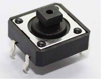  

**Schematic Diagrams:**  


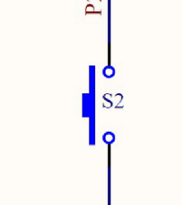

**4. Circuit Connection**


**Connection for V4.0**


**Connection for 2560**

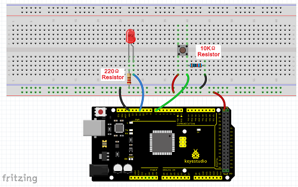

**5.Sample Code**

Now, let's begin the compiling. When the button is pressed, the LED will be on. Based on the previous study, the coding should be easy for you.

In this program, we add a statement of judgment. Here, we use an **if ()** statement.

Arduino IDE is based on C language, so statements of C language such as while, switch etc. can certainly be used for Arduino program.

When we press the button, pin 7 will output high level. We can program pin 11 to output high level and turn on the LED. When pin 7 outputs low level, pin 11 also outputs low level and the LED remains off.


<iframe src=https://create.arduino.cc/editor/keyestudio/2ee7968a-a477-4706-8526-24f81d5308a1/preview?embed style="height:510px;width:100%;margin:10px 0" frameborder=0></iframe>


**6.Test Result**

When the button is pressed, LED is on, otherwise, LED remains off. In this way, the button controlled LED experiment is completed.


The simple principle of this experiment is widely used in a variety of circuit and electric appliances. You can easily come across it in your daily life. One typical example is when you press a certain key on your phone, the backlight will be on.

## Project 7: Active Buzzer

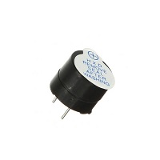

**1.Introduction**

Active buzzer is widely used as a sound making element on computer, printer, alarm, electronic toy, telephone, timer and more. It has an inner vibration source. Simply connect it with 5V power supply, it can buzz continuously.

**2.Hardware Required**

-   V4.0 Board or MEGA 2650 Board\*1

-   Buzzer\*1

-   Breadboard\*1

-   Breadboard Jumper Wire\*2

-   USB cable\*1

**3. Little Knowledge**

There are two kinds of buzzer, active buzzer and passive buzzer. In this lesson, we will use Micro:bit to drive an active buzzer. The active buzzer inside has a simple oscillator circuit which can convert constant direct current into a certain frequency pulse signal. Once active buzzer receives a high level, it will produce an audible beep.

**4.Circuit Connection**

**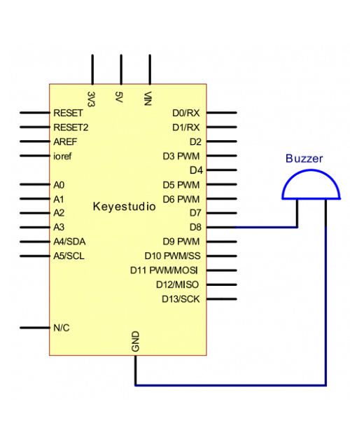**

**Connection for V4.0**


**Connection for 2560**


When connecting the circuit, pay attention to the positive and negative poles of the buzzer. In the photo, you can see there are red and black lines. When the circuit is finished, you can begin the programming.

**5.Sample Code**

Program is simple. You control the buzzer by outputting high/low level.

<iframe src=https://create.arduino.cc/editor/keyestudio/d2528e19-693f-4e77-92bc-0d589f843856/preview?embed style="height:510px;width:100%;margin:10px 0" frameborder=0></iframe>


**6.Test Result**

After uploading the program, the buzzer experiment is completed. You can see the buzzer is ringing.


## Project 8: Passive Buzzer


**1.Introduction**

We can use Arduino to make many interactive works. The most commonly used one is acoustic-optic display. All the previous experiment has something to do with LED. However, the circuit in this experiment can produce sound. Normally, the experiment is done with a buzzer but not a speaker while buzzer is more simpler and easier to use.

The buzzer we introduced here is a passive buzzer. It cannot be actuated by itself, but by external pulse frequencies. Different frequency produces different sound. We can use Arduino to code the melody of a song, which is quite fun and simple.

**2.Hardware Required**

-   V4.0 Board or MEGA 2650 Board\*1

-   Passive Buzzer\*1

-   Breadboard\*1

-   Breadboard Jumper Wire\*2

-   USB cable\*1

**3. Little knowledge**

Passive buzzer is an integrated electronic buzzer without vibration source inside. It must be driven by 2K-5K square wave instead of direct current signals. There is little difference between the two buzzers, but when the pins of the two buzzers are placed up, the passive buzzer comes with green circuit board, and the one sealed with vinyl is an active buzzer.

**4. Circuit Connection**

****

**Connection for V4.0**


**Connection for 2560**


**5.Sample Code**

<iframe src=https://create.arduino.cc/editor/keyestudio/e54930c8-573a-4e6d-8ec1-f3d1ea3df1c7/preview?embed style="height:510px;width:100%;margin:10px 0" frameborder=0></iframe>


**6.Test Result**

After uploading the program, buzzer experiment is finished, you can hear the buzzer sound.


## Project 9: RGB LED


**1.Introduction**

The RGB color mode is a color standard in the industry. It obtains various colors by changing the three color channels of red (R), green (G), and blue (B) and integrating them. RGB denotes the three colors of red, green and blue.

In this project, we use Arduino to mix these three colors in equal amounts to produce white light.

**2.Hardware Required**

-   V4.0 Board or MEGA 2650 Board\*1

-   USB Cable \* 1

-   RGB LED \* 1

-   Resistor \*3

-   Breadboard jumper wire\*5

**3. Little Knowledge**

The monitors mostly adopt the RGB color standard, and all the colors on the computer screen are composed of the three colors of red, green and blue mixed in different proportions.

RGB is inclusive of common cathode RGB and common anode RGB.

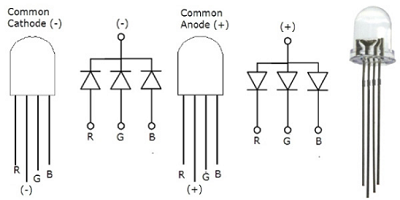

And we could adjust the LED brightness by PWM

**4.Circuit Connection**

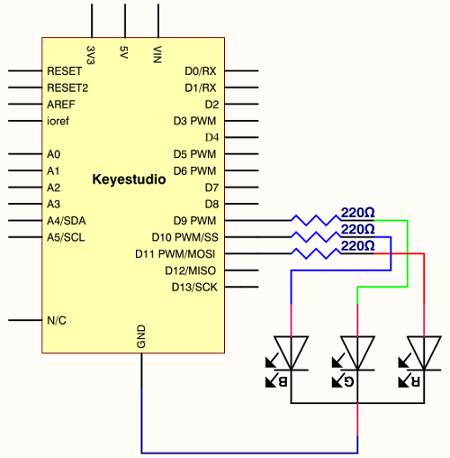

**Connection for V4.0**


**Connection for 2560**


**5.Sample Code**

<iframe src=https://create.arduino.cc/editor/keyestudio/b7afd821-a61a-4499-9a87-ba6b605c7293/preview?embed style="height:510px;width:100%;margin:10px 0" frameborder=0></iframe>

**6.Test Result**

Directly copy the above code into arduino IDE, and click upload, wait for a few seconds, you can see a full-color LED.


## Project 10: Photo Resistor


**1.Introduction**

After completing all the previous experiments, you may acquire some basic understanding and knowledge about Arduino application. We have introduced digital input and output, analog input and PWM.

Now, let’s begin the learning of sensor applications.

Photo Resistor (Photovaristor) is a resistor whose resistance varies from different incident light strength. It's based on the photoelectric effect of semiconductor. If the incident light is intense, its resistance reduces; if the incident light is weak, the resistance increases.

**2.Hardware Required**

-   V4.0 Board or MEGA 2650 Board\*1

-   Photo Resistor\*1

-   Red M5 LED\*1

-   10KΩ Resistor\*1

-   220Ω Resistor\*1

-   Breadboard\*1

-   Breadboard Jumper Wire\*5

-   USB cable\*1

**3. Little Knowledge**

Photovaristor is commonly applied in the measurement of light, light control and photovoltaic conversion (convert the change of light into the change of electricity).

Photo resistor is also being widely applied to various light control circuit, such as light control and adjustment, optical switches, etc.


We will start with a relatively simple experiment regarding to photovaristor application.

Photovaristor is an element that can change its resistance as light strength changes. So need to read the analog value. You can refer to the PWM experiment, replacing the potentiometer with photovaristor. When there is change in light strength, it will make corresponding change on the LED.

**4.Circuit Connection**

****

**Connection for V4.0**


**Connection for 2560**

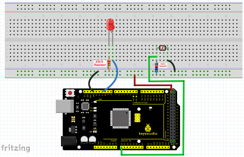

**5.Sample Code**

After wiring, let's begin the program compiling. The program is similar to the PWM.

For change detail, please refer to the Sample Code below.

<iframe src=https://create.arduino.cc/editor/keyestudio/939c43be-281b-46b6-bff3-01bbe380d89f/preview?embed style="height:510px;width:100%;margin:10px 0" frameborder=0></iframe>


**6.Test Result**

After downloading the program, you can change the light strength around the photovaristor, and see the corresponding brightness change of the LED.

Photovaristors has various applications in our everyday. You can make other interesting interactive projects based on this one.


## Project 11: Flame Sensor


**1.Introduction**

Flame sensor (infrared receiving triode) is specially used for robots to find the fire source. This sensor is of high sensitivity to flame.

**2.Hardware Required**

-   V4.0 Board or MEGA 2650 Board\*1

-   Flame Sensor \*1

-   Buzzer \*1

-   10K Resistor \*1

-   Breadboard Jumper Wire\*6

-   USB cable\*1

**3. Little Knowledge**

Flame sensor is based on the principle that infrared ray is highly sensitive to flame. It has an infrared receiving tube specially designed to detect fire, and then to convert the flame brightness into fluctuating level signal. The signals are then input into the central processor and be dealt with accordingly.

The shorter lead of the receiving triode is for negative, the other one for positive. Connect negative to 5V pin, positive to resistor; connect the other end of the resistor to GND, connect one end of a jumper wire to a clip which is electrically connected to sensor positive, the other end to analog pin. As shown below:


**4.Experiment Principle**

When it's approaching a fire, the voltage value read from the analog port will differ. If you use a multimeter, you can see that when there is no fire approaching, the voltage it reads is around 0.3V; when there is fire approaching, the voltage it reads is around 1.0V. The nearer the fire is, the
higher the voltage is.  
So in the beginning of the program, you can initialize voltage value **i** (no fire value); Then, continuously read the analog voltage value **j** and obtain difference value **k=j-i**; compare k with 0.6V (123 in binary) to determine whether there is a fire approaching or not; if yes, the buzzer will buzz.

**5.Circuit Connection**

**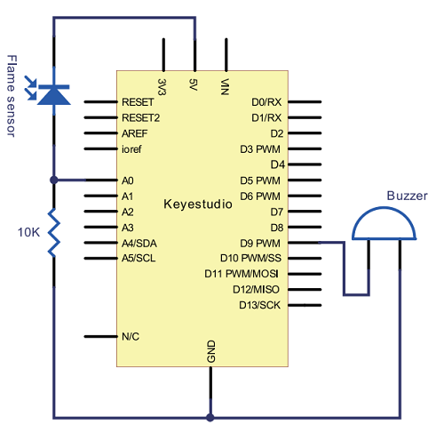**

**Connection for V4.0**


**Connection for MEGA 2560**

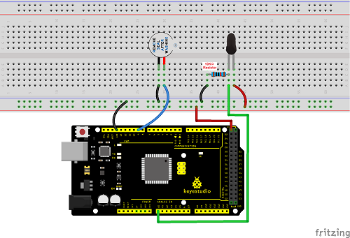

**6.Sample Code**

<iframe src=https://create.arduino.cc/editor/keyestudio/e106691b-b432-420c-bbbd-cabb73c8d4c3/preview?embed style="height:510px;width:100%;margin:10px 0" frameborder=0></iframe>


**7.Test Result**

This program can simulate an alarm when there is a fire. Everything is normal when there is no fire; when there is fire, the alarm will be set off immediately.


## Project 12: LM35 Temperature Sensor

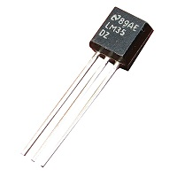

**1.Introduction**

LM35 is a common and easy-to-use temperature sensor. It does not require other hardware. You just need an analog port to make it work. The difficulty lies in compiling the code to convert the analog value it reads into Celsius temperature. In this project, we will guide you how to use LM35 temperature
sensor.

**2. Working Principle**

LM35 is a widely used temperature sensor with many different package types. At room temperature, it can achieve the accuracy of ±1/4°C without additional calibration processing.

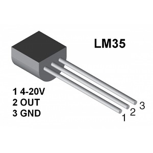

LM35 temperature sensor can produce different voltage by different temperature. When temperature is 0 ℃, it outputs 0V; if increasing 1 ℃, the output voltage will increase 10 mv.

The output temperature is 0℃～100℃, the conversion formula is as follows:


**3.Hardware Required**

-   V4.0 Board or MEGA 2650 Board\*1

-   LM35\*1

-   Breadboard\*1

-   Breadboard Jumper Wire\*5

-   USB cable\*

**4.Circuit Connection** 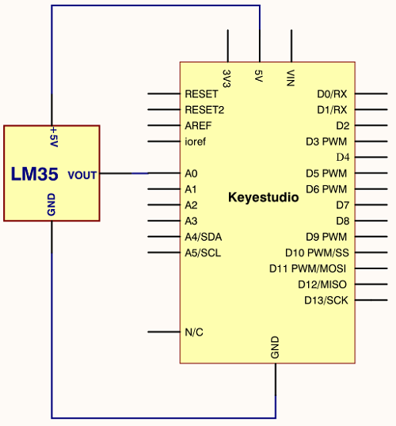

**Connection for V4.0**


**Connection for 2560**


**5.Sample Code**

<iframe src=https://create.arduino.cc/editor/keyestudio/f1251185-2361-408c-8e78-126b54e66173/preview?embed style="height:510px;width:100%;margin:10px 0" frameborder=0></iframe>


**6.Test Result**

After uploading the program, you can open the monitoring window to see the current temperature.


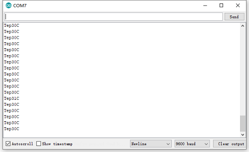

## Project 13: Tilt Switch

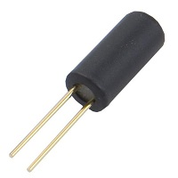

**1.Introduction**

This is a ball switch experiment . The ball switch is also dubbed a steel ball switch. It controls the circuit by connecting guide pin with rolling ball. In this project, we control the LED light by reading the state of the ball switch.

**2.Working Principle**

When one end of the switch is below horizontal position, the switch is on. The voltage of the analog port is about 5V (1023 in binary). The LED will be on.

When the other end of the switch is below horizontal position, the switch is off. The voltage of the analog port is about 0V (0 in binary). The LED will be
off.   
In the program, we determine whether the switch is on or off according to the voltage value of the analog port, whether it's above 2.5V (512 in binary) or not.

**3.Hardware Required**

-   V4.0 Board or MEGA 2650 Board\*1

-   Ball switch\*1

-   Led \*1

-   220Ω Resistor\*1

-   10KΩ resistor\*1

-   Breadboard Jumper Wire\*5

-   USB cable\*1

**4.Circuit Connection**


**Connection for V4.0**


**Connection for 2560**


**5.Sample Code**

<iframe src=https://create.arduino.cc/editor/keyestudio/408c4fd8-2d1b-4f66-9d65-e0ed8837bd2e/preview?embed style="height:510px;width:100%;margin:10px 0" frameborder=0></iframe>


**6.Test Result**

Hold the breadboard with your hand. Tilt it to a certain extent, the LED will be on. If there is no tilt, the LED will be off.

The principle of this experiment can be also applied to relay control.

Experiment now is completed. Thank you!


## Project 14: IR Remote Control


**1.Introduction**

**What is an infrared receiver?**

The signal from the infrared remote controller is a series of binary pulse code. To avoid the other infrared signal interference during the wireless transmission, the signal is pre-modulated at a specific carrier frequency and then send out by an infrared emission diode.

The infrared receiving device needs to filter out other waves and receive signals at that specific frequency and to modulate it back to binary pulse code, known as demodulation.

**2.Working Principle**

The built-in receiver converts the light signal it received from the sender into feeble electrical signal. The signal will be amplified by the IC amplifier. After automatic gain control, band-pass filtering, demodulation, wave shaping, it returns to the original code. The code is then input to the code identification circuit by the receiver's signal output pin.

**3.Pin and Wiring for Infrared Receiver**


Infrared receiver has 3 pins. When you use it, connect VOUT to analog pin, GND to GND, VCC to +5V.


**4.Hardware Required**

-   V4.0 Board or MEGA 2650 Board\*1

-   Infrared Remote Controller \*1

-   Infrared Receiver \*1

-   LED \*6

-   220ΩResistor \*6

-   Breadboard Wire \*11

-   USB cable\*1

**5.Circuit Connection**

First, connect the controller board; then connect the infrared receiver as the above mentioned, connect VOUT to digital pin 11, connect the LEDs with resistors and connect the resistors to pin 2,3,4,5,6,7.


**Connection for V4.0**


**Connection for 2560**

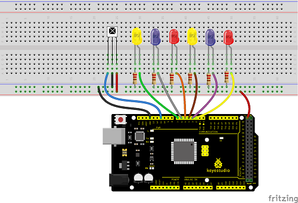

**6.Experimental Principle**

If you want to decode the code from the remote controller, you must first know how it's coded. The coding method we use here is NEC protocol. Below is a brief introduction.

• NEC protocol

**7.Features**

1.  8 bit address and 8 bit command length  
    (2) address and command are transmitted twice for reliability  
    (3) pulse distance modulation  
    (4) carrier frequency of 38 KHZ   
    (5) bit time of 1.125ms or 2.25ms

**8.Protocol is as below**

• Definition of logical 0 and 1 is as below


• Pulse transmitted when button is pressed and immediately released


The picture above shows a typical pulse train of the NEC protocol. With this protocol the LSB is transmitted first. In this case Address \$59 and Command \$16 is transmitted. A message is started by a 9ms AGC burst, which was used to set the gain of the earlier IR receivers. This AGC burst is then followed by a 4.5ms space, which is then followed by the address and command. Address and Command are transmitted twice. The second time all bits are inverted and can be used for verification of the received message. The total transmission time is constant because every bit is repeated with its inverted length. If you are not interested in this reliability, you can ignore the inverted values, or you can expend the Address and Command to 16 bits each!

• Pulse transmitted when button is pressed and released after a period of time


A command is transmitted only once, even when the key on the remote control remains pressed. Every 110ms a repeat code is transmitted for as long as the key remains down. This repeat code is simply a 9ms AGC pulse followed by a 2.25ms space and a 560µs burst.

• Repeat pulse


**Note** when the pulse enters the integrated receiver, there will be decoding, signal amplifying and wave shaping process. So you need to make sure the level of the output is just the opposite from that of the signal sending end.

That is when there is no infrared signal, the output end is in high level; when there is infrared signal, the output end is in low level. You can see the pulse of the receiving end in the oscilloscope. Try to better understand the program based on what you see.

**9.Sample Code**

<iframe src=https://create.arduino.cc/editor/keyestudio/b254b88f-2ccb-4815-b8bd-b167034755ec/preview?embed style="height:510px;width:100%;margin:10px 0" frameborder=0></iframe>


**Note**add IRremote folder into installation directory \\Arduino\\compiler libraries, or you will fail to compile it.

Infrared remote library
[https//github.com/shirriff/Arduino-IRremote](https://github.com/shirriff/Arduino-IRremote)

**10.Test Result**

Decode the coded pulse signal emitted by the remote controller, then execute corresponding action according to the results of the decoding. In this way, you will be able to control your device with remote controller.


Done uploading, open the serial monitor, you can see the result as below.


## Project 15: Analog Value Reading

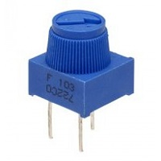

**1.Introduction**

In this experiment, we will begin the study of analog I/O interfaces. On an Arduino, there are 6 analog interfaces numbered from A0 to A5. Next, let's begin our project. Potentiometer used here is a typical output component of analog value that is familiar to us.

**2.Hardware Required**

-   V4.0 Board or MEGA 2650 Board\*1

-   Potentiometer \*1

-   Breadboard\*1

-   Breadboard Jumper Wire\*3

-   USB cable\*1

**3.Potentiometer Features**

Adjustable potentiometer is just a kind of resistor. The resistance is changed by rotating the potentiometer, so is the voltage, speed, brightness and temperature. It is an analog electronic component, which has two states of 0 and 1(high level and low level). The analog quantity is different. Its data state presents a linear state such as 1 to 1000.

**4.Circuit Connection**

In this experiment, we will convert the resistance value of the potentiometer to analog ones and display it on the screen.

This is an application you need to master well for our future experiments.


**Connection for V4.0**


**Connection for 2560**


**5.Sample Code**

The program compiling is simple. An **analogRead ()** Statement can read the value of the interface. The A/D acquisition of Arduino 328 is in 10 bits, so the value it reads is among 0 to 1023.

One difficulty in this project is to display the value on the screen, which is actually easy to learn.

First, you need to set the baud rate in **voidsetup ()**. Displaying the value is a communication between Arduino and PC, so the baud rate of the Arduino should match the one in the PC's software set up. Otherwise, the display will be messy codes or no display at all.

In the lower right corner of the Arduino software monitor window, there is a button for baud rate set up. The set up here needs to match the one in the program. The statement in the program is **Serial.begin()**; enclosed is the baud rate value, followed by statement for displaying. You can either use
**Serial.print()** or **Serial.println()** statement.

<iframe src=https://create.arduino.cc/editor/keyestudio/6855defc-ac3a-4c03-af56-0d0bc9e3c724/preview?embed style="height:510px;width:100%;margin:10px 0" frameborder=0></iframe>


**6.Test Result**

The Sample Code uses the built-in LED connected to pin 13.

Each time the device reads a value, the LED blinks. When you rotate the potentiometer knob, you can see the displayed value change. The reading of analog value is a very common function since most sensors output analog value. After calculation, you can get the corresponding value you need.

Below figure shows the analog value it reads.

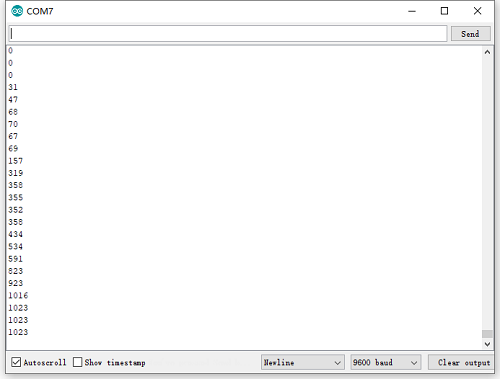

The experiment is now completed. Thank you!


## Project 16: 74HC595 chip


**1.Introduction**

74HC595 chip is a serial output and parallel output device. To put it simply, 74HC595 chip is a combination of 8-digit shifting register, memorizer and equipped with tri-state output.

Here, we use it to control 8 LEDs. You may wonder why use a 74HC595 to control LED? Well, think about how many I/O it takes for an Arduino to control 8 LEDs? Yes, 8.

For an Arduino 328, it has only 20 I/O including analog ports. To save port resources, using 74HC595 enables us to use 3 digital I/O ports to control 8 LEDs!

**2. Hardware Required**

-   V4.0 Board or MEGA 2650 Board\*1

-   74HC595 chip\*1

-   Red M5 LED\*4

-   Green M5 LED\*4

-   220Ω Resistor\*8

-   Breadboard\*1

-   Breadboard Jumper Wires

-   USB cable\*1

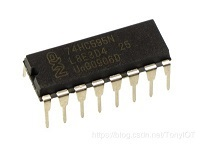

**3. Description**


| Pins No | Name  | Function                     |
|---------|-------|------------------------------|
| 1-7, 15 | Q0-Q7 | Parallel Output              |
| 8       | GND   | GND                          |
| 9       | MR    | Serial Output                |
| 10      |       | Master Reserve , connect 5V  |
| 11      | SH_CP | Shift Register Clock Output  |
| 12      | ST_CP | Storage Register Clock Input |
| 13      | OE    | Output Enable (active LOW)   |
| 14      | DS    | Serial data input            |
| 16      | Vcc   | 5V working voltage           |

-   VCC and GND are used to supply power for chip, the working voltage is 5V.

-   Q0\~Q7:This eight pins are output pins.

-   DS pin is serial input pin, we need to write data into this pin by bit.

-   STCP is a latch pin. The data can be copied to latch and output in parallel after 8-digit data of latch is all transmitted.
    
-   SHCP is a clock pin. The data can be written into storage register.

-   OE is an output enable pin, which is used to make sure if the data of latch is input into Q0-Q7 pins. When in low level, high level is not output. In this experiment, we directly connect to GND to keep low level output data.
    
-   MR is a pin to initialize the pin of storage register. Initialize the internal storage register when low level. In this experiment, we connect to VCC to keep high level.
    
-   Q7S pin is a serial output pin, which is specially used for chip cascade.

**4. Circuit Connection**


**Connection for V4.0**

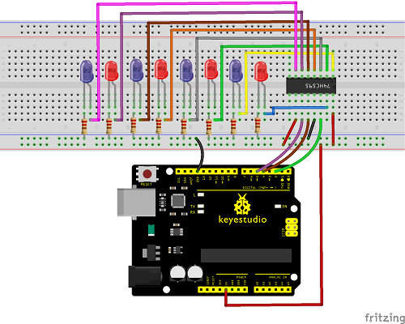

**Connection for 2560 R3**


The circuit may seem complicated, but once you wire it in order, you will find it more easier!

**5. Sample Code**

<iframe src=https://create.arduino.cc/editor/keyestudio/b3fca4fb-c984-4451-8cde-1992d6cefdb5/preview?embed style="height:510px;width:100%;margin:10px 0" frameborder=0></iframe>


**6.Test Result**

After downloading the program, you can see 8 LEDs display 8-bit binary number.


## Project 17: 1-digit LED Segment Display

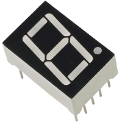

**1. Introduction**

LED segment displays are common for displaying numerical information. It's widely applied on displays of electromagnetic oven, full automatic washing machine, water temperature display, electronic clock, etc. It is necessary for us to learn how it works.

**2. Hardware Required**

-   V4.0 Board or MEGA 2650 Board\*1

-   1-digit LED Segment Display\*1

-   220Ω Resistor\*8

-   Breadboard\*1

-   Breadboard Jumper Wires \*several

-   USB cable\*1

**3. The display principle of the 1-digit LED Segment Display**

LED segment display is a semiconductor light-emitting device. Its basic unit is a light-emitting diode (LED).

LED segment display can be divided into 7-segment display and 8-segment display according to the number of segments. 8-segment display has one more LED unit (for decimal point display) than 7-segment one.

According to the wiring method of LED units, LED segment display can be divided into common anode display and common cathode display. Common anode display refers to the one that combine all the anodes of LED units into one common anode (COM).

For the common anode display, connect the common anode (COM) to +5V. When the cathode level of a certain segment is low, the segment is on; when the cathode level of a certain segment is high, the segment is off.

For the common cathode display, connect the common cathode (COM) to GND. When the anode level of a certain segment is high, the segment is on; when the anode level of a certain segment is low, the segment is off.


Each segment of the display consists of an LED. So when you use it, you also need to use a current-limiting resistor. Otherwise, LED will be burnt out.

In this experiment, we use a common cathode display. As we mentioned above, for common cathode display, connect the common cathode (COM) to GND. When the anode level of a certain segment is high, the segment is on; when the anode level of a certain segment is low, the segment is off.

**4. Circuit Connection**


**Connection for V4.0**


**Connection for 2560**


**5. Sample Code**

There are seven segments for numerical display, one for decimal point display. Corresponding segments will be turned on when displaying certain numbers.

For example, when displaying number 1, b and c segments will be turned on. We compile a subprogram for each number, and compile the main program to display one number every 2 seconds, cycling display number 0 \~ 9.

The displaying time for each number is subject to the delay time, the longer the delay time, the longer the displaying time.

<iframe src=https://create.arduino.cc/editor/keyestudio/76082b2f-d499-43d8-b7e2-230185467a0e/preview?embed style="height:510px;width:100%;margin:10px 0" frameborder=0></iframe>


**6.Test Result**

LED segment display will show the number from 0 to 9.


**Project 18: 4-digit LED Segment Display**


**1. Introduction**

In this experiment, we use an Arduino to drive a common cathode, 4-digit, 7-segment LED display.

For LED display, current-limiting resistors are indispensable.

There are two wiring methods for Current-limiting resistor. One is to connect one resistor for each cathode end, 4 in total for d1-d4 cathode. An advantage for this method is that it requires fewer resistors, only 4. But it cannot maintain consistent brightness, 1, the brightest; 8, the least bright.

Another method is to connect one resistor to each pin. It guarantees consistent brightness, but requires more resistors.

In this experiment, we use 8 Resistors (220Ω). We use 220ΩResistors because of no 100Ω resistor available. If you use 100Ω, the displaying is more brighter.

**2. Hardware Required**

-   V4.0 Board or MEGA 2650 Board\*1

-   4-digit LED Segment Display\*1

-   220Ω Resistor\*8

-   Breadboard\*1

-   Breadboard Jumper Wires \*several

-   USB cable\*1

**3. The display principle of the 4-digit display**

For 4-digit display, there are 12 pins in total. When you place the decimal point downward, the pin on the lower left part is refer to as 1, the upper left part 12. Shown below.


**4. Circuit Connection**


**Connection for V4.0**


**Connection for 2560 R3**


**5. Sample Code**

<iframe src=https://create.arduino.cc/editor/keyestudio/44c36f47-4b2e-4b35-92e8-068c32409869/preview?embed style="height:510px;width:100%;margin:10px 0" frameborder=0></iframe>


**6.Test Result**

Download the above code to the controller board, you can see the LED display shows the number 1234.

**Note：** if it’s not displaying correctly, check the wiring.


## Project 19: 8*8 LED Matrix


**1. Introduction**

LED dot-matrix display can meet the needs of different applications, thus has a broad development prospect. With low-voltage scanning, LED dot-matrix has some advantages such as power saving, long service life, low cost, high brightness, wide angle of view, long visual range, waterproof, and numerous specifications.

This project, we will conduct an LED dot-matrix experiment to experience its charm firsthand.

**2. Hardware Required**

-   V4.0 Board or MEGA 2650 Board\*1

-   1 \* 8\*8 Dot Matrix

-   8 \* Resistor (220Ω)

-   1 \* Breadboard

-   1 \* USB Cable

-   Several\* Jumper Wires

**3. The display principle of the 8\*8 dot-matrix**

The external view of a dot-matrix is shown as follows


The 8\*8 dot-matrix is made up of sixty-four LEDs, and each LED is placed at the cross point of a row and a column.

When the electrical level of a certain row is 1 and the electrical level of a certain column is 0, the corresponding LED will lighten. If you want to light the LED on the first dot, you should set pin 9 to high level and pin 13 to low level.

If you want to light LEDs on the first row, you should set pin 9 to high level and pins 13, 3, 4, 10, 6, 11, 15 and 16 to low level.

If you want to light the LEDs on the first column, set pin 13 to low level and pins 9, 14, 8, 12, 1, 7, 2 and 5 to high level.

The internal view of a dot-matrix is shown as follows


**4. Circuit Connection**


**Connection for V4.0**


**Connection for 2560 R3**


**5. Sample Code for displaying “0”**

<iframe src=https://create.arduino.cc/editor/keyestudio/5100df22-332e-48a7-a05f-31352d6d3836/preview?embed style="height:510px;width:100%;margin:10px 0" frameborder=0></iframe>


**6.Test Result**

Burn the program into V4.0 board, the dot-matrix will display 0.


## Project 20: 1602 LCD


**1. Introduction**

In this experiment, we use an Arduino to drive the 1602 LCD. 1602 LCD has wide applications. In the beginning, 1602 LCD uses a HD44780 controller.
Now, almost all 1602 LCD module uses a compatible IC, so their features are basically the same.

**2. 1602LCD Main Parameters**

-   V4.0 Board or MEGA 2650 Board\*1

-   Display capacity 16 \* 2 characters

-   Chip operating voltage 4.5 \~ 5.5V

-   Working current 2.0mA (5.0V)

-   Optimum working voltage of the module is 5.0V

-   Character size 2.95 \* 4.35 (W \* H) mm

**3. Pin description of 1602 LCD**

| **No.** | **Mark** | **Pin description**       | **No.** | **Mark** | **Pin description**       |
|---------|----------|---------------------------|---------|----------|---------------------------|
| 1       | VSS      | Power GND                 | 9       | D2       | Date I/O                  |
| 2       | VDD      | Power positive            | 10      | D3       | Date I/O                  |
| 3       | VL       | LCD voltage bias signal   | 11      | D4       | Date I/O                  |
| 4       | RS       | Select data/command (V/L) | 12      | D5       | Date I/O                  |
| 5       | R/W      | Select read/write(H/L)    | 13      | D6       | Date I/O                  |
| 6       | E        | Enable signal             | 14      | D7       | Date I/O                  |
| 7       | D0       | Date I/O                  | 15      | BLA      | Back light power positive |
| 8       | D1       | Date I/O                  | 16      | BLK      | Back light power negative |

**4. Interface Description**

1.  Two power pins, one for module power, another one for back light, generally use 5V. In this project, we use 3.3V for backlight.

2.  **VL** is the pin for adjusting contrast ratio. It usually connects a potentiometer(no more than 5KΩ) in series for its adjustment.   In this experiment, we use a 1KΩ resistor. For its connection, it has two methods, namely high potential and low potential. Here, we use low potential method; connect the resistor and then the GND.
    
3.  **RS** is a very common pin in LCD. It's a selecting pin for command/data. When the pin is in high level, it's in data mode; when it's in low level, it's in command mode.

4.  **RW** pin is also very common in LCD. It's a selecting pin for read/write. When the pin is in high level, it's in read operation; if in low level, it's in write operation.

5.  **E** pin is also very common in LCD. Usually, when the signal in the bus is stabilized, it sends out a positive pulse requiring read operation. When this pin is in high level, the bus is not allowed to have any change.

6.  **D0-D7** is 8-bit bidirectional parallel bus, used for command and data transmission.

7.  **BLA** is anode for back light; BLK, cathode for back light.

**5. Four Basic Operations for 1602LCD**

| Read status   | input | RS=L, R/W=H, E=H                              | output | D0-D7=status word |
|---------------|-------|-----------------------------------------------|--------|-------------------|
| Write command | input | RS=L, R/W=H, D0-D7=command code, E=high pulse | output | none              |
| Read data     | input | RS=H, R/W=H, E=H                              | output | D0-D7=data        |
| Write data    | input | RS=H, R/W=L, D0-D7=data, E=high pulse         | output | none              |

**6. Hardware Required**

-   V4.0 Board or MEGA 2650 Board\*1

-   1 \* 1602 LCD

-   1 \* Potentiometer

-   1 \* Breadboard

-   1 \* USB Cable

-   Several\* Jumper Wires

**7.Connection**

It can directly communicate with Arduino. According to the product manual, it has two connection methods, namely 8-bit connection and 4-bit connection.

**8-bit Connection Method**


**Connection for V4.0**


**Connection for 2560 R3**


**8.Sample Code A**

<iframe src=https://create.arduino.cc/editor/keyestudio/51ef8e8d-6383-41ef-9ba1-6bb2a1764a5c/preview?embed style="height:510px;width:100%;margin:10px 0" frameborder=0></iframe>

**bit Connection Method  
**When using this module, 8-bit connection uses all the digital pins of the Arduino, leaving no pin for sensors. What then? You can use 4-bit connection.


**Connection for V4.0  
**


**Connection for 2560 R3**


After the connection, upload below code to the controller board and see how it goes.

**9.Sample Code B**

<iframe src=https://create.arduino.cc/editor/keyestudio/9bd45523-b3ac-4e9f-b2ad-70b2fe33bb6d/preview?embed style="height:510px;width:100%;margin:10px 0" frameborder=0></iframe>

**10. Test Result**

****

## Project 21: Servo Control


**1. Introduction**

Servomotor is a position control rotary actuator. It mainly consists of housing, circuit board, core-less motor, gear and position sensor. For this lesson, we will introduce servo to you.

**2. Working Principle**

The MCU outputs a signal to the servomotor. The motor has a built-in reference circuit that gives out reference signal, cycle of 20ms and width of 1.5ms. The motor compares the acquired DC bias voltage to the voltage of the potentiometer and outputs a voltage difference. The IC on the circuit board will decide the rotate direction accordingly and drive the core-less motor. The gear then pass the force to the shaft. The sensor will determine whether it has reached the commanded position according to the feedback signal.

Servomotors are used in control systems that require to have and maintain different angles. When the motor speed is definite, the gear will drive the potentiometer to rotate. When the voltage difference reduces to zero, the motor stops. Normally, the rotation angle range is among 0-180 degrees.

Servomotor comes with many specifications. But all of them have three connection wires, distinguished by brown, red, orange (different brand may have different color).

Brown one is for GND, red one for power positive, orange one for signal line.


The rotation angle of the servo motor is controlled by regulating the duty cycle of the PWM(Pulse-Width Modulation) signal.

The standard cycle of the PWM signal is 20ms（50Hz）. Theoretically, the width is distributed between 1ms-2ms. The width corresponds the rotation angle from 0° to 90°.

But note that for different brand motor, the same signal may have different rotating angle.


With some basic knowledge, let's learn how to control a servomotor. In this experiment, you only need a servo motor and several jumper wires.

**3. Hardware Required**

-   V4.0 Board or MEGA 2650 Board\*1

-   9G Servo Motor\*1

-   Breadboard Jumper Wire\*3

-   USB cable\*1

**Connection & Sample Code**

There are two ways to control a servomotor with Arduino.

One is to use a common digital sensor port of Arduino to produce square wave with different duty cycle to simulate PWM signal and use that signal to control the positioning of the motor.

Another way is to directly use the Servo function of the Arduino to control the motor. In this way, the program will be more easier but it can only control two-contact motor because of the servo function, only digital pin 9 and 10 can be used.

The Arduino drive capacity is limited. So if you need to control more than one motor, you will need external power.

**4. Method 1**


**Connection for V4.0**


**Connection for 2560 R3**


**Connect the motor to digital pin 9.**

Compile a program to control the motor to rotate in the commanded angle, and display the angle on the screen.

**Sample Code A**

<iframe src=https://create.arduino.cc/editor/keyestudio/4955c9f4-b8ba-43a5-af36-3f9cfd1954fa/preview?embed style="height:510px;width:100%;margin:10px 0" frameborder=0></iframe>


**5. Method 2**

Let's first take a look at the Arduino built-in servo function and some common statements.

1\. **attach（interface）**——select pin for servo, can only use pin 9 or 10.

2\. **write（angle）**——used to control the rotate angle of the servo, can set the angle among 0 degree to 180 degree.

3\. **read（）**——used to read the angle of the servo, consider it a function to read the value in the write() function.

4\. **attached（）**——determine whether the parameter of the servo is sent to the servo pin.

5\. **detach（）**—— disconnect the servo and the pin, and the pin (digital pin 9 or 10) can be used for PWM port.

**Note** the written form of the above statements are " servo variable name. specific statement ()", e.g. myservo. Attach (9).
Still, connect the servo to pin 9.

**Sample Code B**

<iframe src=https://create.arduino.cc/editor/keyestudio/fc194389-f0f2-4720-9aaa-73633175d809/preview?embed style="height:510px;width:100%;margin:10px 0" frameborder=0></iframe>


Above are the two methods to control the servo. You can choose either one according to your liking or actual need.

**6.Test Result**


## Project 22: Stepper Motor


**1. Introduction**

A stepper motor is an electromechanical device which can convert electrical pulses into discrete mechanical movements. The shaft or spindle of a stepper motor rotates in discrete step increments when electrical command pulses are applied to it in the proper sequence.

The motors rotation has several direct relationships to these applied input pulses. The sequence of the applied pulses is directly related to the direction of motor shafts rotation. The speed of the motor shafts rotation is directly related to the frequency of the input pulses and the length of rotation is
directly related to the number of input pulses applied.

One of the most significant advantages of a stepper motor is its ability to be accurately controlled in an open loop system. Open loop control means no feedback information about position is needed. This type of control eliminates the need for expensive sensing and feedback devices such as optical encoders.
Your position is known simply by keeping track of the input step pulses.

**2. Hardware Required**

-   V4.0 Board or MEGA 2650 Board\*1

-   Stepper Motor\*1

-   Stepper Motor driver\*1

-   Jumper Wire \*1

-   USB cable\*1

**3. Features**

-   The rotation angle of the motor is proportional to the input pulse.

-   The motor has full torque at standstill(if the windings are energized)

-   Precise positioning and repeatability of movement since good stepper motors have an accuracy of – 5% of a step and this error is non cumulative from one step to the next.

-   Excellent response to starting/stopping/reversing.

-   Very reliable since there are no contact brushes in the motor. Therefore the life of the motor is simply dependant on the life of the bearing.

-   The motors response to digital input pulses provides open-loop control, making the motor simpler and less costly to control.

-   It is possible to achieve very low speed synchronous rotation with a load that is directly coupled to the shaft.

-   A wide range of rotational speeds can be realized as the speed is proportional to the frequency of the input pulses.

**4.Parameters of Stepper Motor 28BYJ-48**

-   Model 28BYJ-48

-   Rated Voltage 5VDC

-   Number of Phase 4

-   Speed Variation Ratio 1/64

-   Stride Angle 5.625° /64

-   Frequency 100Hz

-   DC Resistance 50Ω±7%(25℃)

-   Idle In-traction Frequency \> 600Hz

-   Idle Out-traction Frequency \> 1000Hz

-   In-traction Torque \>34.3mN.m(120Hz)

-   Self-positioning Torque \>34.3mN.m

-   Friction Torque 600-1200 gf.cm

-   Pull in Torque 300 gf.cm

-   Insulated Resistance \>10MΩ(500V)

-   Insulated Electricity Power 600VAC/1mA/1s

-   Insulation Grade A

-   Rise in Temperature \<40K(120Hz)

-   Noise \<35dB(120Hz,No load,10cm)

**5.Circuit Connection**


**Connection for V4.0**


**Connection for 2560 R3**


**6. Sample Code**

<iframe src=https://create.arduino.cc/editor/keyestudio/8c5916f6-768f-4270-9ae2-fb0bc3473196/preview?embed style="height:510px;width:100%;margin:10px 0" frameborder=0></iframe>


**7. Test Result**


## Project 23: PIR Motion Sensor


**1. Introduction**

Pyroelectric infrared motion sensor can detect infrared signals from a moving person or moving animal, and output switching signals.

It can be applied to a variety of occasions to detect the movement of human body.

Conventional pyroelectric infrared sensors require body pyroelectric infrared detector, professional chip, complex peripheral circuit, so it is more bigger with complex circuit, and lower reliability.

Now we launch this new pyroelectric infrared motion sensor, which is specially designed for Arduino.

It uses an integrated digital body pyroelectric infrared sensor, and has smaller size, higher reliability, lower power consumption as well as simpler peripheral circuit.

**2. Hardware Required**

-   V4.0 Board or MEGA 2650 Board\*1

-   PIR Motion Sensor\*1

-   Jumper Wire \*1

-   USB cable\*1

**3. Specification**

-   Input Voltage 3.3 \~ 5V (6V Maximum)

-   Working Current 15uA

-   Working Temperature -20 \~ 85 ℃

-   Output Voltage High 3V, Low 0V

-   Output Delay Time (High Level) About 2.3 to 3 Seconds

-   Detection Angle 100 °

-   Detection Distance 7 meters

-   Output Indicator LED (When output HIGH, it will be ON)

-   Pin limit Current 100mA

**4. Circuit Connection**


**Connection for V4.0**


**Connection for MEGA 2560 R3**


**5. Sample Code**

<iframe src=https://create.arduino.cc/editor/keyestudio/a1837158-c8fa-477f-9f01-24745106bac4/preview?embed style="height:510px;width:100%;margin:10px 0" frameborder=0></iframe>


**6. Test Result**

If the sensor detects someone moving nearby, D13 indicator on V4.0 board will light up, and "Somebody is in this area!" is displayed on the serial monitor.

If no detecting the movement, D13 indicator on V4.0 board will be off, and "No one!" is displayed on the serial monitor.


## Project 24: Analog Gas Sensor


**1. Introduction**

This analog gas sensor - MQ2 is used in gas leakage detecting equipment in consumer electronics and industrial markets.

This sensor is suitable for LPG, I-butane, propane, methane, alcohol, Hydrogen and smoke detection. It has high sensitivity and quick response. In addition, the sensitivity can be adjusted by the potentiometer.

**2. Hardware Required**

-   V4.0 Board or MEGA 2650 Board\*1

-   Analog Gas Sensor\*1

-   Jumper Wire \*1

-   USB cable\*1

**3. Specification**

-   Power Supply 5V

-   Interface Type Analog

-   Wide detecting scope

-   Quick response and high sensitivity

-   Simple drive circuit

-   Stable and long lifespan

**4. Circuit Connection**


**Connection for V4.0**


**Connection for MEGA 2560 R3**


**5. Sample Code**

<iframe src=https://create.arduino.cc/editor/keyestudio/732e9f68-a9a0-4808-98af-ffe4aa6805d4/preview?embed style="height:510px;width:100%;margin:10px 0" frameborder=0></iframe>

**6. Test Result**


## Project 25: ADXL345 Three Axis Acceleration


**1. Introduction**

The ADXL345 is a small, thin, low power, 3-axis MEMS accelerometer with high resolution (13-bit) measurement at up to +-16 g. Digital output data is formatted as 16-bit twos complement and is accessible through either a SPI (3- or 4-wire) or I2C digital interface.

The ADXL345 is well suited to measure the static acceleration of gravity in tilt-sensing applications, as well as dynamic acceleration resulting from motion or shock. Its high resolution (4 mg/LSB) enables measurement of inclination change less than 1.0 degrees.

**2. Hardware Required**

-   V4.0 Board or MEGA 2650 Board\*1

-   ADXL345 Sensor\*1

-   Jumper Wire \*1

-   USB cable\*1

**3. Specification**

-   2.0-3.6V DC Supply Voltage

-   Ultra Low Power 40uA in measurement mode, 0.1uA in standby@ 2.5V

-   Tap/Double Tap Detection

-   Free-Fall Detection

-   SPI and I2C interfaces

**4. Circuit Connection**


**Connection for V4.0**


**Connection for MEGA 2560 R3**


**5. Sample Code**

<iframe src=https://create.arduino.cc/editor/keyestudio/b2871d4c-fc42-47a1-acd3-09024cca7ab4/preview?embed style="height:510px;width:100%;margin:10px 0" frameborder=0></iframe>


**6. Test Result**

Wiring as the above diagram and power on, then upload the code and open the serial monitor, it will display the triaxial acceleration of sensor and its status, as the graph shown below.


## Project 26: HC-SR04 Ultrasonic Sensor


**1. Introduction  
**The HC-SR04 Ultrasonic Sensor is a very affordable proximity/distance sensor that is mainly used for object avoidance in various robotics projects.

It essentially gives your Arduino eyes / spacial awareness and can prevent your robot from crashing or falling off a table. It has also been used in turret applications, water level sensing, and even as a parking sensor.

This simple project will use the HC-SR04 sensor with an Arduino and a Processing sketch to provide a more interactive display on your computer screen.

**2. Hardware Required**

-   V4.0 Board or MEGA 2650 Board\*1

-   Ultrasonic Sensor\*1

-   Jumper Wire \*1

-   USB cable\*1

**3. Specification**

-   Working Voltage DC 5V

-   Working Current 15mA

-   Working Frequency 40KHz

-   Max Range 4m

-   Min Range 2cm

-   Measuring Angle 15 degree

-   Trigger Input Signal 10µS TTL pulse

-   Echo Output Signal Input TTL lever signal and the range in proportion

**4. Circuit Connection**


**Connection for V4.0**


**Connection for MEGA 2560 R3**


**5. Sample Code**

<iframe src=https://create.arduino.cc/editor/keyestudio/e8c3e96e-0969-43a0-95a5-ea063276bf8c/preview?embed style="height:510px;width:100%;margin:10px 0" frameborder=0></iframe>

**6. Test Result**

After upload well the code to V4.0 board, then open the serial monitor. When place an object in front of the ultrasonic sensor (from near and far), it will detect the distance of object. The value will be displayed on the monitor.


## Project 27: Joystick Module


**1. Introduction**

Lots of robot projects need joystick. This module provides an affordable solution. By simply connecting to two analog inputs, the robot is at your commands with X, Y control. It also has a switch that is connected to a digital pin.

This joystick module can be easily connected to Arduino by IO Shield. This module is for Arduino(V5) with cable supplied.

**2. Hardware Required**

-   V4.0 Board or MEGA 2650 Board\*1

-   Joystick Module\*1

-   Jumper Wire \*1

-   USB cable\*1

**3. Specification**

-   Supply Voltage 3.3V to 5V

-   Interface Analog x2, Digital x1

**4. Circuit Connection**


**Connection for V4.0**


**Connection for MEGA 2560 R3**


**5. Sample Code**

<iframe src=https://create.arduino.cc/editor/keyestudio/9b23e224-dfde-4ed4-9393-453dfaaf1142/preview?embed style="height:510px;width:100%;margin:10px 0" frameborder=0></iframe>

**6. Test Result**

Wiring well and uploading the code, open the serial monitor and set the baud rate to 9600, push the joystick, you will see the value shown below.


## Project 28: 5V Relay Module


**1. Introduction**

This single relay module can be used in interactive projects. This module uses SONGLE 5v high-quality relay.

It can also be used to control the lighting, electrical and other equipment. The modular design makes it easy to expand with the Arduino Board (not included).

The Relay output is by a light-emitting diode. It can be controlled through digital IO port, such as solenoid valves, lamps, motors and other high current or high voltage devices.

**2. Hardware Required**

-   V4.0 Board or MEGA 2650 Board\*1

-   Relay Module\*1

-   Jumper Wire \*1

-   USB Cable\*1

**3. Specification**

-   Type Digital

-   Rated Current 10A (NO) 5A (NC)

-   Maximum Switching Voltage 150VAC 24VDC

-   Digital Interface

-   Control Signal TTL level

-   Rated Load 8A 150VAC (NO) 10A 24VDC (NO), 5A 250VAC (NO/NC) 5A 24VDC (NO/NC)

-   Maximum Switching Power AC1200VA DC240W (NO) AC625VA DC120W (NC)

-   Contact Action Time 10ms

**4. Circuit Connection**


**Connection for V4.0**


**Connection for MEGA 2560 R3**


**5. Sample Code**

<iframe src=https://create.arduino.cc/editor/keyestudio/6436de68-ae9d-43b5-8d87-9f3320850b37/preview?embed style="height:510px;width:100%;margin:10px 0" frameborder=0></iframe>

**6. Test Result**


## Project 29: DS3231 Clock Module


**1. Introduction**

DS3231 is equipped with integrated TCXO and crystal, which makes it a cost-effective I2C real time clock with high precision.

The device carries a battery input, so even if you disconnect the main power supply, it can still maintain accurate timing. The integrated oscillator ensures the long-term accuracy of the device and reduces the number of components.

DS3231 provides both commercial and industrial temperature range and supports 16 pins small-outline package (300mil).

The module itself can adapt to the system of 3.3V and 5V without level switch, which is quite convenient!

**2. Hardware Required**

-   V4.0 Board or MEGA 2650 Board\*1

-   DS3231 Clock Module\*1

-   Jumper Wire \*1

-   USB cable\*1

**3. Specification**

-   Temperature Range -40 to +85;

-   Timing Accuracy ± 5ppm (±0.432 seconds / day)

-   Provide battery backup for continuous timing

-   Low power consumption

-   Device package and function compatible with DS3231

-   Complete clock calendar function contains seconds and minutes, hour, week,date, month, and year timing and provides leap year compensation until 2100.

-   Two calendar clock

-   Output 1Hz and 32.768kHz

-   Reset output and Input Debounce of Pushbutton

-   High speed (400kHz), I2C serial bus

-   Supply voltage +3.3V to +5.5V

-   Digital temperature sensor with a precision of±3℃

-   Working temperature -40 \~ C to +85 \~ C

-   16 pins Small Outline Package (300mil)

**4. Circuit Connection**

This module adopts the IIC test method, so only need to connect ‘SDA’ to Arduino A4, ‘SCL’ to A5, ‘+’ to VCC and ‘-’ to GND as follows

**Connection for V4.0**


**Connection for MEGA 2560 R3**


**5. Sample Code**

Before compiling the code, you’d better put  [DS3231 library](https://github.com/rodan/ds3231) under file into Arduino catalogue.

<iframe src=https://create.arduino.cc/editor/keyestudio/5973cdfa-7bfa-4006-a8bb-98241a7c7544/preview?embed style="height:510px;width:100%;margin:10px 0" frameborder=0></iframe>

**6. Test Result**

Done uploading the code to arduino, open the serial monitor and get the following results.


## Project 30: DHT11 Temperature and Humidity Sensor


**1. Introduction**

This DHT11 Temperature and Humidity Sensor features calibrated digital signal output with the temperature and humidity sensor complex. Its technology ensures high reliability and excellent long-term stability. A high-performance 8-bit microcontroller is connected.

This sensor includes a resistive element and a sense of wet NTC temperature measuring devices. It has the advantages of excellent quality, fast response, anti-interference ability and high cost performance.

Each DHT11 sensor features extremely accurate calibration data of humidity calibration chamber. The calibration coefficients stored in the OTP program memory, internal sensors detect signals in the process, and we should call these calibration coefficients.

The single-wire serial interface system is integrated to make it quick and easy. Qualities of small size, low power, and 20-meter signal transmission distance make it a widely applied application and even the most demanding one. Convenient connection and special package can be provided according to your need.

**2. Hardware Required**

-   V4.0 Board or MEGA 2650 Board\*1

-   DHT11 sensor\*1

-   Jumper Wire \*1

-   USB cable\*1

**3. Specification**

-   Supply Voltage +5 V

-   Temperature Range 0-50 °C error of ± 2 °C

-   Humidity 20-90% RH ± 5% RH error

-   Interface digital

**4. Circuit Connection**


**Connection for V4.0**


**Connection for MEGA 2560 R3**


**5. Sample Code**

Please download the [DHT11Lib](https://github.com/RobTillaart/Arduino/tree/master/libraries/DHTlib) firstly. Or [see the website](http://playground.arduino.cc/Main/DHTLib)

<iframe src=https://create.arduino.cc/editor/keyestudio/31a33f6b-4692-45ff-b0d9-7696121cad86/preview?embed style="height:510px;width:100%;margin:10px 0" frameborder=0></iframe>


**6.Test Result**

Wire it up well and upload the above code to V4.0 board.


Then open the serial monitor and set the baud rate to 9600, you will see the current temperature and humidity value.


## Project 31: Soil Humidity Sensor


**1. Introduction**

This is a simple soil humidity sensor aims to detect the soil humidity. If the soil is lack of water, the analog value output by the sensor will decrease; otherwise, it will increase.

If you use this sensor to make an automatic watering device, it can detect whether your botany is thirsty so as to prevent it from withering when you go out. Using the sensor with Arduino controller makes your plant more comfortable and your garden smarter.

The soil humidity sensor module is not as complicated as you might think, and if you need to detect the soil in your project, it will be your best choice.

The sensor is set with two probes inserted into the soil, then with the current go through the soil, the sensor will get resistance value by reading the current changes between the two probes and convert such resistance value into moisture content.

The higher the moisture (less resistance) is, the higher conductivity the soil has.

The surface of the sensor have undergone metallization process to prolong its service life. Insert it into the soil and then use the AD converter to read it. With the help of this sensor, the plant can remind of you I need water.

**2. Hardware Required**

-   V4.0 Board or MEGA 2650 Board\*1

-   Soil Humidity Sensor\*1

-   Jumper Wire \*1

-   USB cable\*1

**3. Specification**

-   Power Supply Voltage 3.3V or 5V

-   Working Current ≤ 20mA

-   Output Voltage 0-2.3V (When the sensor is totally immersed in water, the voltage will be 2.3V)

-   5V power supply (the higher humidity, the higher the output voltage)

-   Sensor Type Analog output

-   Interface Definition Pin1- signal, pin2- GND, pin3 - VCC

**4. Circuit Connection**


**Connection for V4.0**


**Connection for MEGA 2560 R3**


**5. Sample Code**

<iframe src=https://create.arduino.cc/editor/keyestudio/2075d1d0-a86c-4b20-826c-2707e7532c1d/preview?embed style="height:510px;width:100%;margin:10px 0" frameborder=0></iframe>

**6. Test Result**


## Project 32: RC522 RFID Module


**1. Introduction**

MF522-AN module adopts Philips MFRC522 original reader circuit chip design, easy to use, low cost, suitable for equipment development, development of advanced applications, the need for the user of RF card terminal design / production. It can be loaded directly into a variety of readers molds.

Module uses voltage of 3.3V, through the SPI interface using simple few lines, it can be directly connected to any CPU board communication modules to guarantee stable and reliable work and reader distance.

**2. Hardware Required**

-   V4.0 Board or MEGA 2650 Board\*1

-   RFID Module\*1

-   Jumper Wire \*1

-   USB cable\*1

**3. Specification**

1.  Current 13-26mA / DC 3.3V

2.  Idle Current 10-13mA / DC 3.3V

3.  Sleep Current \<80uA

4.  Peak Current \<30mA

5.  Operating Frequency 13.56MHz

6.  Supported card types mifare1 S50, mifare1 S70, mifare UltraLight, mifare Pro, mifare Desfire
    
7.  Environmental Operating Temperature -20-80 degrees Celsius

8.  Environment Storage Temperature -40-85 degrees Celsius

9.  Relative Humidity 5% -95%

**4. Circuit Connection**


**Connection for V4.0**


**Connection for 2560 R3**


**5. Sample Code**

<iframe src=https://create.arduino.cc/editor/keyestudio/1a394e3e-a70a-40d1-8e86-aecc73f19032/preview?embed style="height:510px;width:100%;margin:10px 0" frameborder=0></iframe>


Note if you want to use MEGA 2560 R3, please in the code change

**const int chipSelectPin = 10;//if the controller is** V4.0

**const int chipSelectPin = 53;//if the controller is MEGA2560**

**6. Test Result**

In this experiment, when the IC card approaches, RFID module will write data to the IC card and read the card’s data, you can see the data on the monitor window. Shown below.


